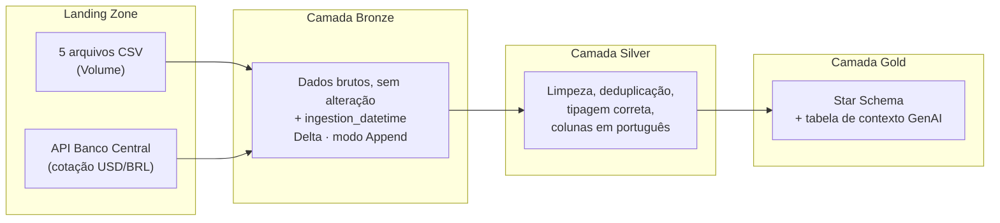

# CineData Analytics — Engenharia de Dados (Rocket Lab Visagio 2026)

Pipeline de dados end-to-end no Databricks (PySpark/SQL), seguindo a **Arquitetura Medalhão** (Bronze, Silver e Gold), com modelagem dimensional (**Star Schema**) e uma tabela de contexto para um assistente de IA (RAG). Projeto desenvolvido para o processo seletivo de estágio **Rocket Lab 2026.2** da **Visagio**.

A base combina dados TMDB/IMDb, entregues de forma intencionalmente suja e fragmentada em 5 arquivos CSV, mais a cotação do dólar extraída em tempo real da API do Banco Central.

## Arquitetura



Cada camada tem seu próprio notebook, e cada transformação de negócio é validada por um framework de **Data Quality** reutilizável (`dq_check` / `dq_check_unique`), que registra PASS/FAIL com contagem de linhas afetadas antes da gravação em Delta.

## Star Schema (Camada Gold)

- **`dim_movies`** — dimensão central: metadados de cada filme.
- **`fact_movies_performance`** — métricas financeiras (USD/BRL) e de engajamento (TMDB/IMDb), grão de um registro por filme.
- **`dim_genres` / `dim_people` / `dim_companies` / `dim_reviews`** — dimensões periféricas.
- **`bridge_movie_genre` / `bridge_movie_person` / `bridge_movie_company`** — tabelas-ponte, resolvendo as relações N:N entre filme e gênero/pessoa/produtora sem duplicar o grão da fato.
- **`gold_genai_movies_context`** — tabela de contexto (não faz parte do Star Schema em si) que alimenta o Vector Search do time de IA.

## Estrutura do repositório

```
notebooks/
├── Landing_to_Bronze.ipynb   # ingestão dos 5 CSVs + API do Banco Central
├── Bronze_to_Silver.ipynb    # limpeza, deduplicação, tipagem, tradução
└── Silver_to_Gold.ipynb      # Star Schema, tabela GenAI, Desafio de Analytics
job.yaml                      # definição do Databricks Workflow (exportada)
docs/
└── prints/
    └── job_execution.png     # print da execução de sucesso do Job (dependências entre tasks)
```

## Como rodar

1. **Upload dos dados**: carregue os 5 arquivos CSV como Volume em `/Volumes/workspace/bronze/landing`.
2. **`Landing_to_Bronze.ipynb`**: cria catalog/schemas/volume, valida a landing zone, grava as tabelas Bronze em Delta (modo Append) e extrai a cotação do dólar via API do Banco Central (últimos 7 dias corridos por padrão — ajustável pelos widgets `widget_data_inicio`/`widget_data_fim`).
3. **`Bronze_to_Silver.ipynb`**: limpa, deduplica, tipa corretamente e traduz as 7 tabelas da Silver (`tb_info_filmes`, `tb_financeiro_filmes`, `tb_metricas_engajamento`, `tb_avaliacoes_usuarios`, `tb_generos`, `tb_pessoas_empresas`, `tb_cotacao_dolar`).
4. **`Silver_to_Gold.ipynb`**: constrói o Star Schema completo, a tabela de contexto para IA e responde às 6 perguntas do Desafio de Analytics.
5. **Orquestração**: o `job.yaml` define um Databricks Workflow com 3 tasks (`to_Bronze` → `to_Silver` → `to_Gold`) com dependência explícita e agendamento configurado, simulando uma rotina real de atualização.

## Principais decisões de projeto

A base é intencionalmente suja, então boa parte do trabalho foi investigar e documentar o porquê de cada regra de negócio a partir de evidência real nos dados (não suposição). Alguns destaques:

- **Column Shift em múltiplas colunas**: valores de outras colunas vazando para campos numéricos/texto (ex.: idioma vazando pra `Diretor`, gênero vazando pra `Produtora`, nome de pessoa vazando pra contagem de votos, e um ano de lançamento vazando pra `popularidade`) — cada caso identificado, quantificado e tratado como resíduo com uma regra documentada, sempre confirmada com o dado bruto antes do fix.
- **Whitespace invisível**: um caractere Unicode de espaço não-padrão (` `, `​`, ``) escapava da checagem de string vazia porque o `trim()` padrão do Spark só remove o espaço ASCII — corrigido com `regexp_replace` explícito.
- **"Casca de banana" dos nulos**: na tabela `gold_genai_movies_context`, cada campo que concatena a frase final passa por `coalesce()`/fallback textual individual antes da concatenação, evitando que um único campo nulo apague o documento inteiro (armadilha explícita do `concat()`/`||`).
- **Cotação de dólar "vigente"**: como a API do Banco Central só cobre uma janela recente (não o histórico de décadas das datas de lançamento), a conversão USD→BRL usa a cotação mais recente disponível de forma uniforme — decisão de projeto documentada no código.
- **Status "não-Lançado" na tabela fato**: mantidos por decisão de projeto (não há filtro explícito no grão pedido pelo enunciado); validado com dado real que isso não distorce nenhuma das 6 perguntas de negócio (apenas 114 dos 97.879 filmes têm métrica financeira fora do status "Lançado").

## Desafio de Analytics — Respostas

*números obtidos via `display()` no notebook `Silver_to_Gold.ipynb`*

### 1. Receita total (R$) somada de todos os filmes da base

**R$ 834.732.810.004,24**


### 2. Os 5 filmes com maior popularidade

| Título | Popularidade |
|---|---|
| blue beetle | 2994.357 |
| Gran Turismo | 2680.593 |
| The Nun II | 1692.778 |
| Meg 2: The Trench | 1567.273 |
| retribution | 1547.22 |


### 3. Quantidade de filmes por gênero (maior para o menor)

| Gênero | Qtd. filmes |
|---|---|
| Drama | 30.457 |
| Documentary | 18.612 |
| Comedy | 17.348 |
| Thriller | 9.424 |
| Horror | 9.163 |
| Romance | 6.996 |
| Action | 5.541 |
| Crime | 4.320 |
| Animation | 4.159 |
| TV Movie | 3.676 |
| Science Fiction | 3.490 |
| Family | 3.371 |
| Mystery | 3.019 |
| Fantasy | 2.982 |
| Adventure | 2.597 |
| Music | 2.573 |
| History | 2.181 |
| War | 869 |
| Western | 383 |


### 4. Os 10 filmes de maior receita (título, receita em US$ e R$, posição via `RANK()`)

| # | Título | Receita (US$) | Receita (R$) |
|---|---|---|---|
| 1 | Avengers: Endgame | 2.800.000.000,00 | 14.439.320.000,00 |
| 2 | Avatar: The Way of Water | 2.320.250.281,00 | 11.965.298.674,09 |
| 3 | AVENGERS: INFINITY WAR | 2.052.415.039,00 | 10.584.099.114,62 |
| 4 | spider-man: no way home | 1.921.847.111,00 | 9.910.773.366,72 |
| 5 | The Lion King | 1.663.075.401,00 | 8.576.313.535,42 |
| 6 | Top Gun: Maverick | 1.488.732.821,00 | 7.677.246.284,61 |
| 7 | Barbie | 1.428.545.028,00 | 7.366.863.854,89 |
| 8 | The Super Mario Bros. Movie | 1.355.725.263,00 | 6.991.339.608,76 |
| 9 | Black Panther | 1.349.926.083,00 | 6.961.433.817,42 |
| 10 | Star Wars: The Last Jedi | 1.332.698.830,00 | 6.872.594.596,43 |


### 5. Ator com mais participações nos filmes lançados nos últimos 2 anos

Data de referência (lançamento mais recente realizado na base): **2026-02-19**

| Ator | Qtd. participações |
|---|---|
| **Kevin Hart** | **64** |
| Brandon H. Morgan | 59 |
| John Travolta | 59 |
| David Chang | 59 |
| Stacy Hall | 59 |
| Olivia Park | 59 |
| Ben Schwartz | 59 |
| Alex Dauphin | 59 |
| Nathalie Emmanuel | 59 |
| Josh Hartnett | 59 |


### 6. Produtora com maior lucro nos últimos 5 anos

| Produtora | Lucro total (US$) |
|---|---|
| **Universal Pictures** | **5.772.329.679,00** |
| Marvel Studios | 4.953.462.823,00 |
| Columbia Pictures | 3.662.050.755,00 |
| Pascal Pictures | 2.701.952.454,00 |
| Illumination | 2.431.353.473,00 |
| Paramount | 2.239.394.101,00 |
| 20th Century Studios | 2.212.815.245,00 |
| Kevin Feige Productions | 2.138.205.367,00 |
| Lightstorm Entertainment | 1.860.250.281,00 |
| Heyday Films | 1.635.495.727,00 |


## Orquestração (Databricks Workflow)

Job com 3 tasks — `to_Bronze` → `to_Silver` → `to_Gold` — com dependência explícita entre elas (uma task só inicia após a conclusão bem-sucedida da anterior) e agendamento configurado para simular uma rotina de atualização em produção. Definição exportada em `job.yaml`; print da execução de sucesso, mostrando as dependências entre as tasks, em `docs/prints/job_execution.png`.

## Autor

Aimê Guimarães — Processo seletivo Rocket Lab 2026.2 (Visagio)
